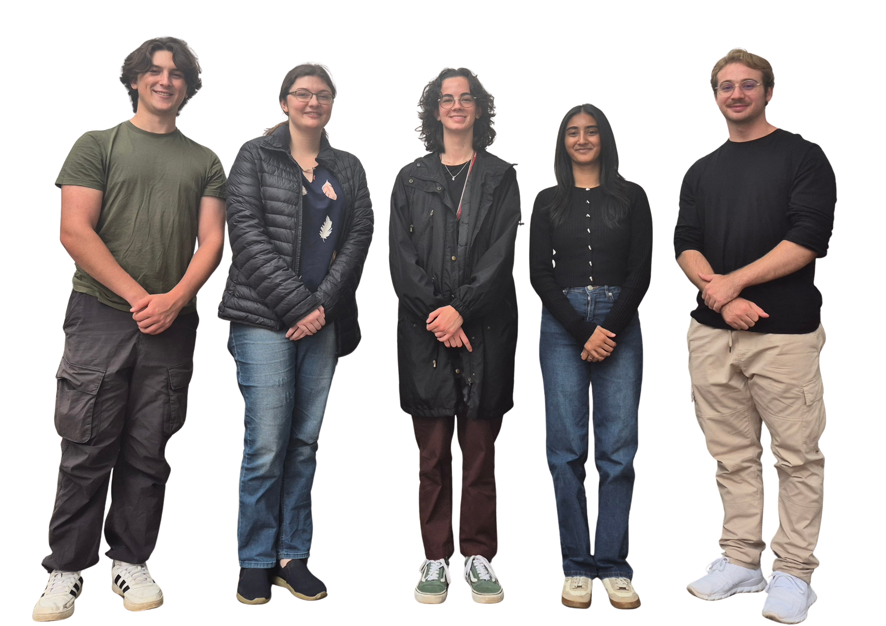

  

  
<strong>CloudSherpa</strong>

  
<strong>An AI-Driven Multi-Cloud FinOps Platform</strong>

## Documentation

Visit our [official documentation site](https://cos301-se-2026.github.io/CloudSherpa/) for more details.

## Project Overview

CloudSherpa is an AI-driven cloud cost optimization platform designed to analyze infrastructure usage and spending patterns across major cloud providers, including Amazon Web Services, Microsoft Azure, and Google Cloud Platform. 

As organizations migrate to cloud-native environments, managing resource efficiency is a significant challenge. CloudSherpa acts as a set of financial guardrails by collecting operational monitoring and billing data, and applying machine learning models to detect anomalies and predict future costs. Through an interactive web-based dashboard, users can visualize resource usage, forecast spending, and receive intelligent optimization recommendations to support data-driven cloud management decisions.

## Current Status & Branch Strategy

**Status: Active Development**

To maintain code quality and deployment stability, we strictly follow a main/dev/feature branch strategy:

* **[`main`](https://github.com/COS301-SE-2026/CloudSherpa/tree/main)**: This branch is strictly reserved for stable, production-ready code. Code is only merged into this branch after passing rigorous automated testing, Quality Assurance (QA), and User Acceptance Testing (UAT).
* **[`dev`](https://github.com/COS301-SE-2026/CloudSherpa/tree/dev)**: This is our active integration branch. Completed features are merged here first for testing and verification before being promoted to `main`.
* **`feature/*`**: Short-lived branches created from `dev` for individual features/fixes. Once complete and reviewed, they are merged back into `dev`.

## About Team BitFlip

  

Team BitFlip is a cross-functional group of dedicated software engineering students committed to transparency, accountability, and quality-focused delivery. We utilize an Agile delivery framework to ensure continuous alignment with our stakeholders' vision. 

**Role Allocations:**
* **Megan Norval** - *Team Lead & Core Backend Architect*
* **Gerard Jordaan** - *DevOps Architect, Full-Stack Contributor & Tester*
* **Karishma Boodhoo** - *Frontend UI/UX Engineer*
* **Cherise Heyl** - *API & Systems Integration Engineer, & Tester*
* **Flip Venter** - *Frontend Application Developer*

---
*Developed in partnership with BBD for the COS 301 Capstone Project (2026).*