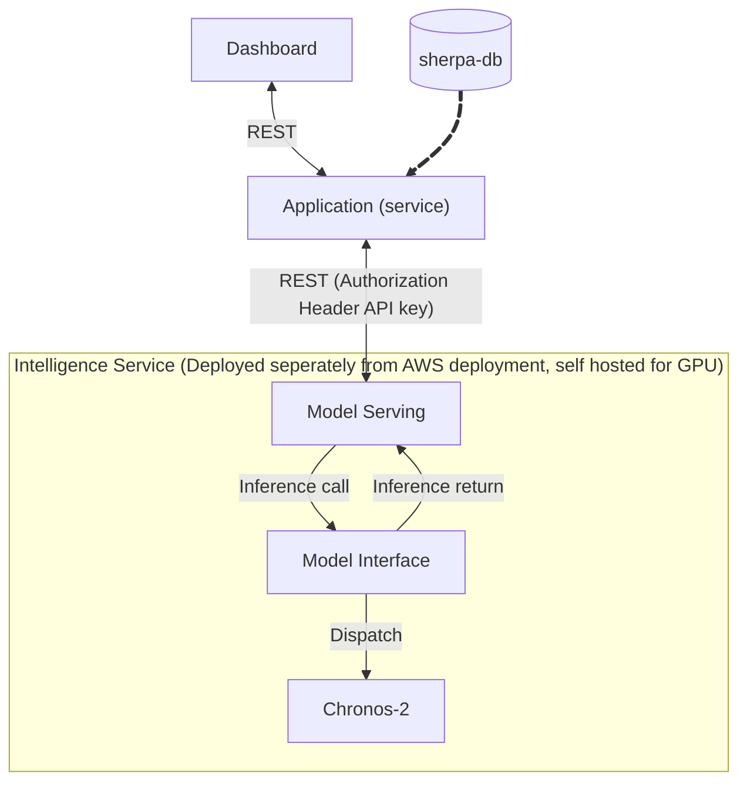

**Title:** Intelligence Service Obtaining Historical Context
**Status:** Proposed
**Context:** The forecasting model requires historical context to forecast values
Alternatives:
1. Open a direct connection between the intelligence service and the database

Decision: Use the Application Service to query the required historical context using the existing database connection and communicate context with intelligence service via an HTTP protocol

Consequence: 
+ Reduces operational complexity, not needing to open DB connection from intelligence service
+ Decouples the intelligence service from the database schema
+ Reduces attack surface by not introducing additional paths to the DB that can potentially introduce high risk vulnerabilities
- Network latency due to large payloads
- API contract maintainence

Notes:
Note that no particular HTTP protocol is mentioned, at first the REST protocol will be used due to familiarity and time pressure, if performance significantly degrades persistent connections or serialization in formats other than JSON should be considered