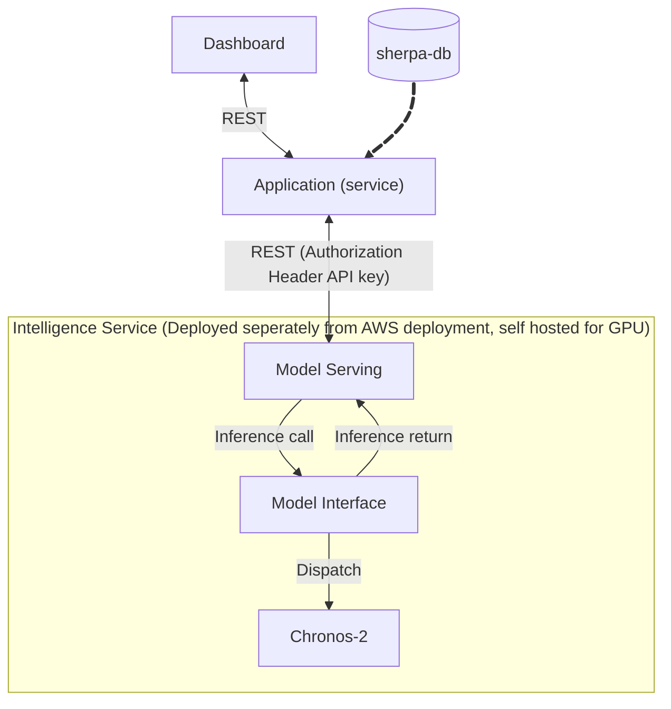
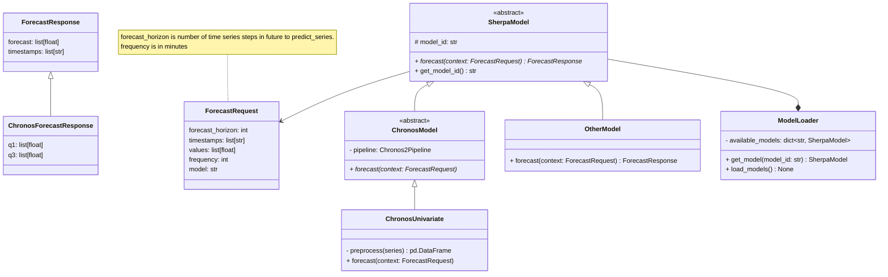

# Running the Intelligence Service

## Locally

1. Initialize & activate python venv

```sh
python3 -m venv .venv
source .venv/bin/activate
```

2. Install dependencies
```sh
pip install -r requirements.txt
```

3. Run fastapi dev server
```sh
cd src
fastapi dev --port <of-your-choosing>
```

## Docker

> Note that making GPU resources accessible to container not yet configured, so model will use cpu for inference 

1. Build the image
```sh
docker build -t intelligence-service -f Dockerfile .
```

2. Run 
```sh
docker run -p 5000:5000 --name intelligence-service-container intelligence-service
```

# Design
## Informal flowchart


## UML Class Diagram of Model Serving Hierarchy
