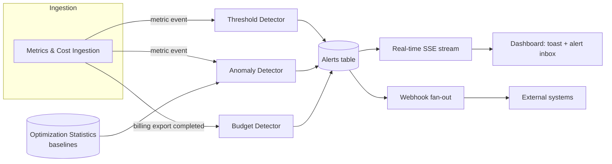

# Automated Alerts Engine

## Overview

The Automated Alerts engine continuously watches a user's cloud metrics and cost data and proactively notifies users when something needs their attention, for example, a resource is misbehaving, a metric looks abnormal compared to its own history, or spend is trending over budget. 

Instead of requiring users to keep dashboards open and notice problems themselves, the engine evaluates incoming data in the background and surfaces **alerts** through the dashboard in-app notification preferences, and outbound webhooks.

## Motivation

Today, users only discover problems by manually reviewing dashboards. This means:
- Performance regressions (e.g. runaway CPU) can go unnoticed until they cause an outage or cost spike.
- Unusual metric behavior that doesn't cross a hard-coded threshold is invisible.
- Overspend is only discovered after the billing cycle closes, when it's too late to act.

## Goals

- **Threshold Alerts** - let a user define a simple numeric rule (`>`, `>=`, `<`, `<=`, `==`) against a specific metric on a specific resource, and be notified the moment it's violated.
- **Anomaly Alerts** - automatically flag metric values that are statistically unusual for a resource, without requiring the user to configure anything, by comparing live values against a precomputed baseline.
- **Budget Alerts** - let a user set a spending cap (cross-account, per cloud account, or per resource) and be notified when actual spend over a trailing window meets or exceeds it.
- Avoid alert fatigue: repeated violations of the same condition should update a single alert rather than spamming new ones.
- Give users control: alerts can be muted (globally or individually) and enabled/disabled without deleting their configuration.
- Make alerts consumable outside the dashboard via webhooks, so users can wire alerts into their own tooling.

## Concepts

| Concept | Meaning |
|---|---|
| **Alert type** | What kind of condition produced the alert: `THRESHOLD`, `ANOMALY`, or `BUDGET`. |
| **Severity** | How serious the alert is: `WARNING` or `CRITICAL`. |
| **Status** | Whether the underlying rule that produces this alert is `ACTIVE` or has been `DISABLED` by the user. |
| **Canonical key** | A stable identifier for "this exact condition" (e.g. a specific threshold on a specific resource). Used to deduplicate (a condition that keeps firing updates one alert record instead of creating new ones every time). |
| **In-app notification silence** | A per-alert mute, independent of disabling the alert entirely. There is also a global in-app notification toggle in user preferences. |

## Architecture Overview

At a high level, alerts are produced by three independent detectors that share a common alert store, a common real-time delivery channel, and a common webhook fan-out:

## Alert Types

### Threshold Alerts

A user picks a resource, a metric, an operator, and a value (e.g. "CPU utilization on i-0123 > 80%"). As metric events stream in, every enabled threshold for that resource/metric is evaluated. A violation:

1. Is matched against a canonical key of the form "this threshold, this resource" so repeat violations update the same alert instead of creating duplicates.
2. Produces an alert whose severity matches the threshold's configured severity.
3. Is broadcast in real time and fanned out as a webhook (if configured).

If a user disables the alert for a given threshold, it will not be recreated on subsequent violations until re-enabled.

### Anomaly Alerts

Anomaly detection requires no configuration from the user. It runs automatically for every resource/metric that has an established statistical baseline. For each incoming metric value:

1. The most recent baseline (mean, standard deviation, sample size) is looked up.
2. If there isn't enough history yet (a minimum sample size is required) or the baseline has no variance, the metric is skipped (there isn't enough data to say what's "normal.")
3. A z-score is computed: how many standard deviations the current value is from the mean.
4. Values that are moderately unusual raise a `WARNING`; values that are extremely unusual raise a `CRITICAL`. Values within normal range don't alert at all.

This gives users a safety net for problems they never thought to set an explicit threshold for.

### Budget Alerts

A user sets a budget: an amount, a trailing window in days, and a scope (across all cloud accounts, one cloud account, or one specific resource):

1. All enabled budgets relevant to that account are gathered (the tenant-wide budget, the account-level budget, and any resource-level budgets for resources under that account.)
2. For each budget, actual spend over the trailing `window_days` is summed at the matching scope.
3. If spend meets or exceeds the budget amount, an alert is raised (or an existing one for that budget is updated) at `WARNING` severity.
4. As with the other detectors, subsequent breaches update the same alert rather than duplicating it, and a user-disabled budget alert won't be recreated.

## External Integrations: Webhooks

Every alert additionally produces a webhook event so users can integrate alerts with external systems. Each alert type maps to its own event type and payload shape, containing the fields relevant to that alert.

## User Experience

- **Alerts inbox**: a dedicated page listing all alerts with search, type filtering, and at-a-glance total/critical/warning counts. Each row shows status, severity, type, and scope, and supports enabling/disabling, muting in-app notifications, viewing details, and deleting.
- **Toasts**: new alerts (and alerts that escalate from `WARNING` to `CRITICAL`) surface as a toast from anywhere in the app, with a link into the alerts inbox (unless the alert is disabled, individually muted, or the user has turned off in-app notifications globally).
- **Budget & threshold configuration**: users can create, edit, enable/disable, and delete budgets and thresholds, separately from viewing the alerts they produce.