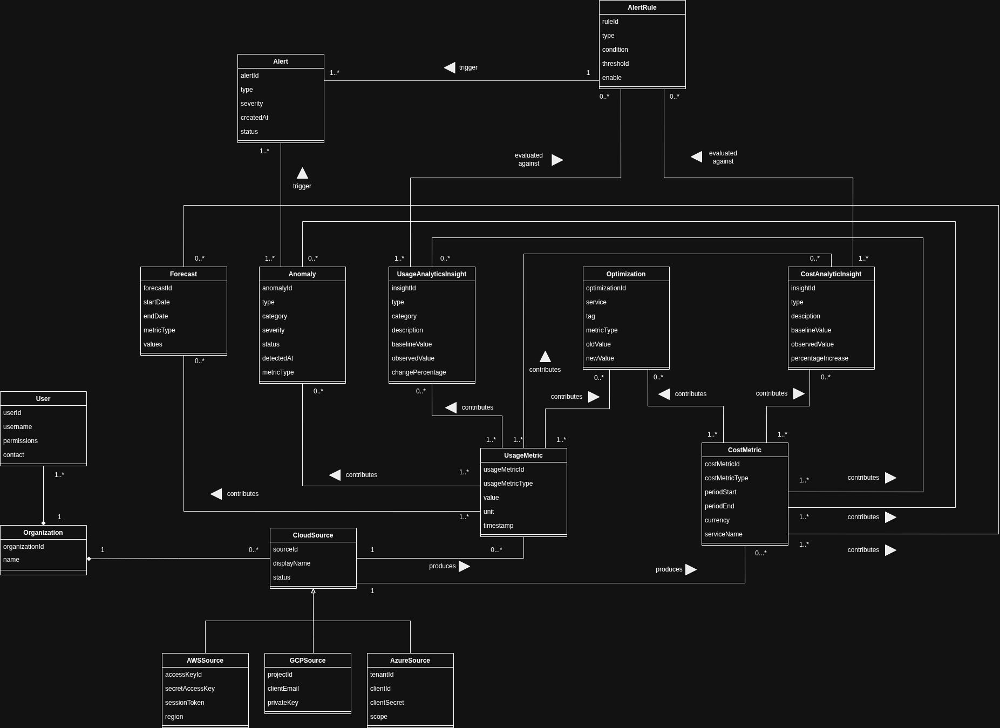
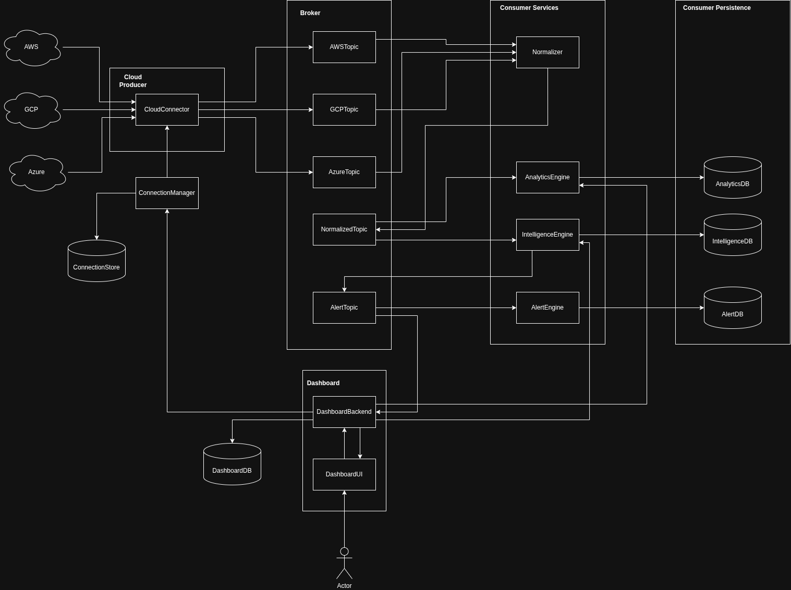

# CloudSherpa Software Design Reference

!!! warning
    All content, whether it be diagrams or requirements, in this document is subject to agile evolution. Team BitFlip values working software over comprehensive documentation in line with the agile manifesto. The CloudSherpa design is continually evaluated and iteratively improved as requirements evolve and implementation progresses.

!!! note
    Click on images to zoom

## Domain Model

## Architecture diagram

## Appendix