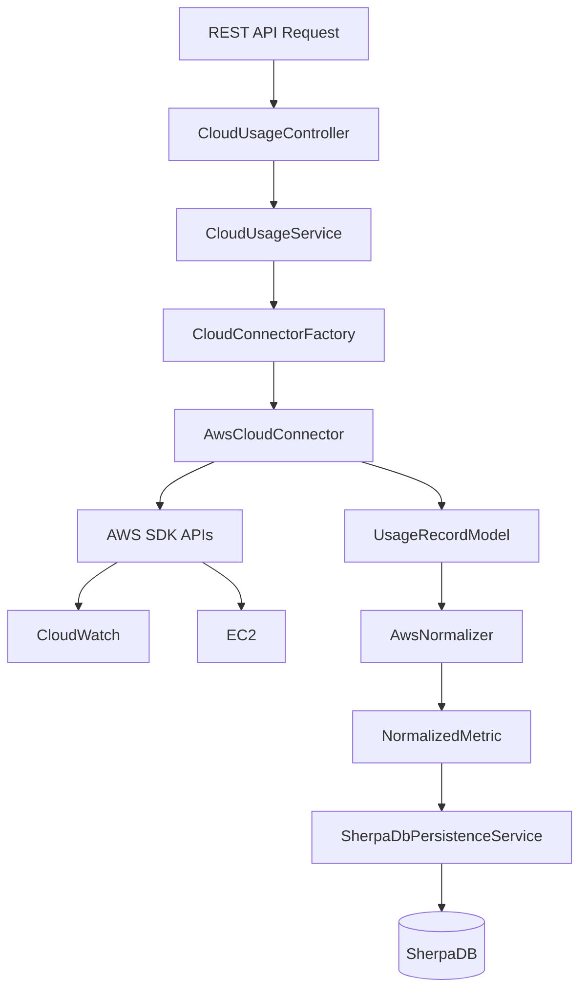
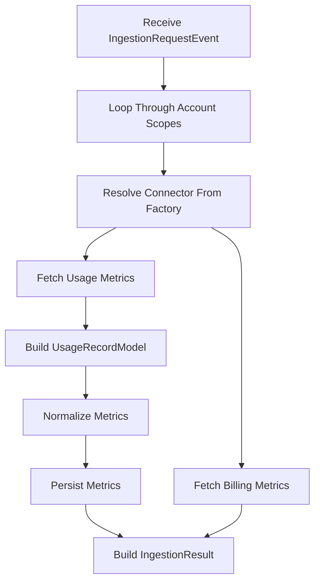
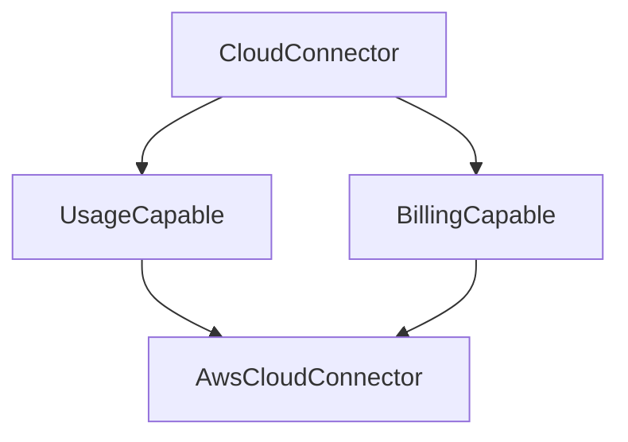

# CloudSherpa Ingestion Service

## Billing & Usage Data Model Documentation

---

## 1. Overview

This document defines the **canonical data models** used by the ingestion service to represent:

- **Billing data** (financial cost records)
- **Usage data** (resource/metric consumption)

These models are designed to normalize data across:

- Amazon Web Services (AWS)
- Microsoft Azure
- Google Cloud Platform (GCP)

and pass through the ingestion and normalization pipeline for downstream service use.

---

## Data Flow and Component Overview

## High-Level Architecture



---

## Request Flow

### 1. API Request

A client sends an ingestion request to one of the REST endpoints:

```text
POST /api/events/ingest
POST /api/events/ingest/mock
POST /api/events/ingest/mockNoise
```

The request includes:

- provider scopes
- requested services
- metrics
- time ranges
- aggregation periods

Example:

```json
{
  "userId": "11111111-2222-3333-4444-555555555555",
  "from": "2026-05-04T22:00:00Z",
  "to": "2026-05-06T00:00:00Z",
  "period": 14400,
  "includeUsage": true,
  "includeBilling": false,
  "scopes": [
    {
      "provider": "AWS",
      "accountId": "test-account",
      "serviceScopes": [
        {
          "name": "AWS/EC2",
          "instances": [
            {
              "identifierName": "InstanceId",
              "values": ["i-0ec321a1c8ed4915c", "i-0123456789abcdef0"]
            }
          ],
          "metrics": [
            "CPUUtilization",
            "NetworkIn",
            "NetworkOut",
            "DiskReadBytes",
            "DiskWriteBytes"
          ]
        },
        {
          "name": "AWS/RDS",
          "instances": [
            {
              "identifierName": "DBInstanceIdentifier",
              "values": ["prod-orders-db", "analytics-db"]
            }
          ],
          "metrics": [
            "CPUUtilization",
            "DatabaseConnections",
            "ReadLatency",
            "WriteLatency",
            "FreeStorageSpace"
          ]
        },
        {
          "name": "AWS/LAMBDA",
          "instances": [
            {
              "identifierName": "FunctionName",
              "values": ["payment-service", "email-processor"]
            }
          ],
          "metrics": ["Invocations", "Errors", "Duration", "Throttles"]
        },
        {
          "name": "AWS/DYNAMODB",
          "instances": [
            {
              "identifierName": "TableName",
              "values": ["UsersTable", "OrdersTable"]
            }
          ],
          "metrics": [
            "ConsumedReadCapacityUnits",
            "ConsumedWriteCapacityUnits",
            "ReadThrottleEvents",
            "WriteThrottleEvents"
          ]
        },
        {
          "name": "AWS/S3",
          "instances": [
            {
              "identifierName": "BucketName",
              "values": ["cloudsherpa-prod-data", "cloudsherpa-logs"]
            }
          ],
          "metrics": [
            "BucketSizeBytes",
            "NumberOfObjects",
            "AllRequests",
            "FirstByteLatency"
          ]
        }
      ]
    }
  ]
}
```

---

## Core Components

## CloudUsageController

The controller exposes REST endpoints for ingestion operations.

### Responsibilities

- Accept HTTP requests
- Validate request bodies
- Delegate processing to `CloudUsageService`
- Return ingestion results

### Endpoints

| Endpoint                       | Purpose                           |
| ------------------------------ | --------------------------------- |
| `/api/events/ingest`           | Real cloud ingestion              |
| `/api/events/ingest/mock`      | Limited fixed synthetic test data |
| `/api/events/ingest/mockNoise` | Dynamic synthetic noisy data      |

---

## CloudUsageService

This is the orchestration layer of the ingestion system.

### Responsibilities

- Process ingestion requests
- Resolve the correct cloud connector
- Fetch usage and billing records
- Normalize metrics
- Persist normalized metrics
- Aggregate results

### Service Workflow



---

## ConnectorFactory

The `CloudConnectorFactory` is one of the most important extensibility points in the ingestion architecture.

### Purpose

It dynamically resolves the correct connector implementation for a cloud provider.

Instead of hardcoding AWS-specific logic into the service layer, the service requests a connector by provider name.

Example:

```java
CloudConnector connector =
    connectorFactory.getConnector("AWS");
```

This allows the ingestion service to remain provider-agnostic.

---

## Factory Pattern Benefits

### Extensibility

New providers can be added without changing the ingestion logic.

Example future providers:

- Azure
- Google Cloud

---

### Decoupling

The service layer does not need to know implementation details of AWS SDK calls.

---

### Maintainability

Provider-specific code is isolated inside connector implementations.

---

## Connector Hierarchy



---

## AwsCloudConnector

The AWS connector is responsible for interacting with AWS services through the AWS SDK.

### Responsibilities

- Connect to AWS APIs
- Retrieve EC2, EKS, and other service metrics
- Retrieve CloudWatch metrics
- Generate mock data
- Generate noisy synthetic data

### Key AWS Integrations

- EC2
- CloudWatch

---

## UsageRecordModel

`UsageRecordModel` represents a provider-specific usage metric returned from a cloud provider connector.

It acts as the intermediate representation between provider-specific APIs and the normalization layer.

---

---

## Normalization Layer

Different cloud providers expose metrics in different formats.

The normalization layer converts provider-specific metrics into a unified internal schema.

Example:

```text
AWS CPUUtilization
        ↓
NormalizedMetric
```

### Benefits

- Cross-provider analytics
- Standardized anomaly detection
- Unified dashboard queries
- Easier ML feature engineering

---

## AwsNormalizer

The AWS normalizer converts AWS-specific usage records into normalized metrics.

### Responsibilities

- Unit normalization
- Standard naming
- Metric formatting
- Schema consistency

---

## Persistence Layer

Normalized metrics are stored using:

```text
SherpaDbPersistenceService
```

### Responsibilities

- Persist normalized metrics
- Store ingestion records
- Support analytics queries
- Support anomaly detection pipelines

---

## Mock Ingestion System

The ingestion service includes a synthetic data generation system for testing and demonstrations. This data is produced in the
same format as is returned by the normal ingestion endpoint, allowing seamless switching between development testing and real
endpoint queries.

### Features

- Mock metric generation
- Noise injection
- Trend simulation
- Controlled anomalies
- Time-series generation

This is especially useful for:

- frontend development and visualization
- anomaly testing
- demos
- performance testing
- integration testing

---

## Error Handling Strategy

The ingestion service is designed to be resilient.

### Examples

#### Persistence Failures

Persistence errors do not necessarily stop ingestion processing.

#### Empty Metrics

Empty provider responses are handled gracefully.

#### Provider Isolation

Failures in one provider connector do not affect connector resolution architecture.

---

## 2. Design Principles

### 2.1 Provider-Agnostic

All fields are normalized to support multiple cloud providers without embedding provider-specific schemas.

### 2.2 Scoping

Every record includes identifiers for:

- AWS accounts
- Azure subscriptions
- GCP projects

This ensures correct attribution when multiple deployments are involved.

### 2.3 Timestamps

All timestamps use `java.time.Instant` (UTC) to:

- Avoid timezone ambiguity
- Ensure consistency across distributed systems

### 2.4 Pipeline Records

Records passed through the ingestion pipeline must be:

- Self-contained
- Traceable
- Idempotent-friendly (identical calls provide identical results when the data for those calls have been finalized)

---

## 3. BillingRecord Model

### 3.1 Purpose

Represents **cost data** associated with cloud resource usage.

This is the **source of truth for cost analysis**. Cost prediction will
use `UsageRecord` data as a temporary proxy, but for detailed analysis, periodic billing
information may be ingested to serve as a more accurate reference. The challenge with
this is that some providers only update these records periodically.

---

### 3.2 Structure

| Field      | Type   | Description                            |
| ---------- | ------ | -------------------------------------- |
| `recordId` | UUID   | Unique identifier for the record       |
| `provider` | String | Cloud provider (`AWS`, `AZURE`, `GCP`) |

---

### Scope Fields

The diverse interfaces across the three primary providers necessitates
multiple scope fields to allow the request for data to be provider-agnostic for
the consumer.

| Field              | Description                   |
| ------------------ | ----------------------------- |
| `accountId`        | AWS account identifier        |
| `subscriptionId`   | Azure subscription identifier |
| `projectId`        | GCP project identifier        |
| `billingAccountId` | Billing account (Azure/GCP)   |

---

### Resource Information

| Field          | Description                             |
| -------------- | --------------------------------------- |
| `serviceName`  | Cloud service (e.g. EC2, VM, BigQuery)  |
| `resourceId`   | Unique resource identifier              |
| `resourceType` | Type of resource (instance, disk, etc.) |
| `region`       | Geographic region                       |

---

### Cost Information

| Field           | Description                        |
| --------------- | ---------------------------------- |
| `cost`          | Monetary cost                      |
| `usageQuantity` | Quantity consumed (e.g. hours, GB) |
| `unit`          | Unit of measurement                |
| `currency`      | Currency code (e.g. USD)           |
| `pricingModel`  | Pricing type (Reserved, Spot etc.) |

---

### Time Fields

| Field                | Description           |
| -------------------- | --------------------- |
| `usageStartTime`     | Start of usage window |
| `usageEndTime`       | End of usage window   |
| `billingPeriodStart` | Billing cycle start   |
| `billingPeriodEnd`   | Billing cycle end     |

---

### Metadata

| Field  | Description               |
| ------ | ------------------------- |
| `tags` | Provider-defined metadata |

---

### Pipeline Metadata

| Field                | Description                        |
| -------------------- | ---------------------------------- |
| `ingestionTimestamp` | When the record was ingested       |
| `ingestionId`        | Identifier for ingestion job/event |
| `source`             | Data source (e.g. CUR, CloudWatch) |

---

## 4. UsageRecord Model

### 4.1 Purpose

Represents **operational usage metrics**.

Examples:

- CPU utilization
- Network throughput
- Disk I/O

For some APIs such as CloudWatch, one API request may only fetch
a single metric per request in the free tier, so multiple requests may need to be made to retrieve
all relevant usage data.

---

### 4.2 Structure

| Field      | Type   | Description       |
| ---------- | ------ | ----------------- |
| `recordId` | UUID   | Unique identifier |
| `provider` | String | Cloud provider    |

---

### Scope Fields

| Field            | Description        |
| ---------------- | ------------------ |
| `accountId`      | AWS account        |
| `subscriptionId` | Azure subscription |
| `projectId`      | GCP project        |

---

### Resource Information

| Field          | Description         |
| -------------- | ------------------- |
| `resourceId`   | Resource identifier |
| `resourceType` | Type of resource    |
| `serviceName`  | Service name        |
| `region`       | Region              |

---

### Usage Metrics

| Field        | Description                   |
| ------------ | ----------------------------- |
| `metricName` | Metric (e.g. CPU utilization) |
| `value`      | Metric value                  |
| `unit`       | Metric unit                   |

---

### Time Fields

| Field         | Description                 |
| ------------- | --------------------------- |
| `timestamp`   | Metric timestamp            |
| `periodStart` | Start of aggregation window |
| `periodEnd`   | End of aggregation window   |

---

### Dimensions

| Field        | Description                         |
| ------------ | ----------------------------------- |
| `dimensions` | Provider-specific metric dimensions |

---

### Metadata

| Field  | Description       |
| ------ | ----------------- |
| `tags` | Resource metadata |

---

### Pipeline Metadata

| Field                | Description                            |
| -------------------- | -------------------------------------- |
| `ingestionTimestamp` | When record was ingested               |
| `ingestionId`        | Trace identifier                       |
| `source`             | Data source (e.g. CloudWatch, Monitor) |

---

## 5. Important Notes

### 5.1 Billing vs Usage Mismatch

Billing and usage data:

- Are collected from different systems
- May have different aggregation levels
- Will not perfectly align

As previously stated, usage may be used as temporary predictor for price, and
normalisation will be required.

---

### 5.2 Multi-Scope Ingestion

Each record represents **one scope**:

- One AWS account
- One Azure subscription
- One GCP project

Connectors will loop through their known scopes to provide all data
for a particular account, allowing data collection across deployments, projects, etc.

---

## 6. Summary

These models provide:

- A unified abstraction over multi-cloud billing and usage
- Strong support for event-driven ingestion
- A scalable foundation for analytics and optimization

---
