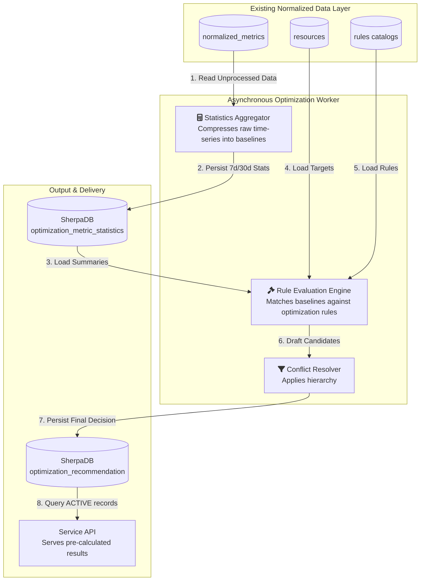
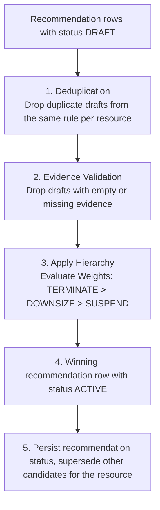
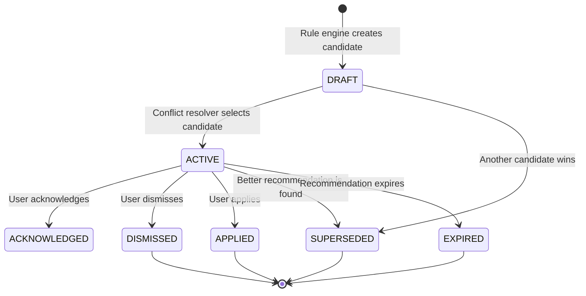
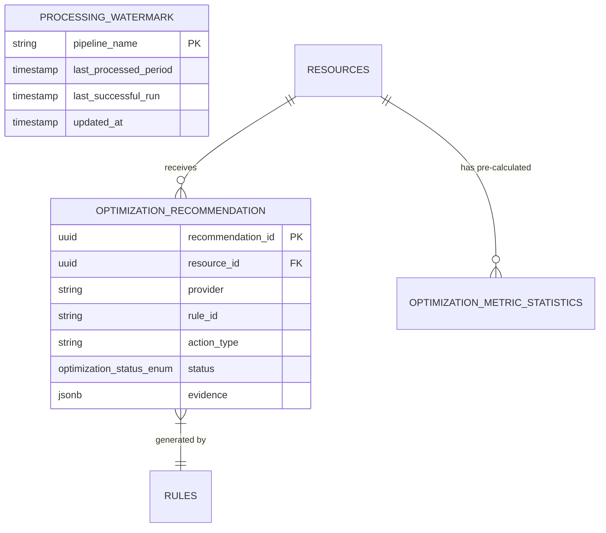

# CloudSherpa Optimization Recommendation System

## Overall Optimization Recommendation Architecture

The **CloudSherpa Optimization Recommendation** Engine employs an asynchronous, batch-processing architecture designed to decouple heavy analytical queries from synchronous user interactions.

This system begins its lifecycle directly at the database tier. It reads from the existing normalized data, processes it in the background, and outputs finalized, highly performant records for the dashboard to consume.



## Component Responsibilities

### Asynchronous Optimization Worker

This is a scheduled background process responsible for all heavy lifting. Driven by a standard **Spring scheduler**, the worker runs **once each day**.

- **Scheduling & Reading**: It reads the `processing_watermark` table to see where it left off, pulls the last 24 hours of unprocessed normalized metrics from SherpaDB to update the baselines, evaluates the rules, updates the recommendations, and goes back to sleep.
- **Calculating**: Computes heavy statistical summaries, including percentiles and standard deviations, and saves them to SherpaDB.
- **Evaluating**: Runs the generated statistics against optimization rules.
- **Resolving**: Filters out duplicate or mutually exclusive actions, such as choosing "Terminate" over "Downsize".
- **Persisting**: Writes the final, resolved recommendation, including the mathematical evidence, to the database.

### Service Application

The API layer acts as a lightweight delivery mechanism.

- **Reading**: Queries the `optimization_recommendation` table for active records.
- **State Management**: Updates the status of a recommendation when a user interacts with it, such as changing the status to `ACKNOWLEDGED` or `DISMISSED`.
- **Constraint**: The API must not calculate P95, standard deviations, or any other expensive statistics during a request.

### Database

- **SherpaDB**: It provides the input context (`resources`, `catalogs`) and stores the output artifacts (`optimization_metric_statistics`, `optimization_recommendation`, and processing watermarks).

### Dashboard

- **Display**: Renders the active recommendations and their supporting evidence.
- **Evidence Visualization**: Displays the underlying evidence, such as showing the user that their P95 CPU was only 12%, to build trust in the automated recommendation.
- **Actionable Controls**: Allows the user to acknowledge or dismiss recommendations.

## Statistical Aggregation Approach

The statistical aggregation approach is designed to prevent system timeouts by moving all complex math out of the user's critical path. It uses a watermark-based processing strategy.

- **The Watermark Strategy**: The Optimization Scheduler relies on a durable `processing_watermark` table. When the scheduler wakes up, it checks this table to see exactly when it last successfully processed data for a specific tenant.
- **Database-Native Calculation**: Whenever possible, statistical functions, such as averages and maximum values, are pushed down to the database level using native SQL analytical functions rather than pulling millions of raw rows into the application's memory heap.
- **Persistent Storage**: The resulting summaries are upserted into the `optimization_metric_statistics` table. The Rule Engine will only ever query this summary table, never the raw metrics tables.

## Required Statistical Windows and Metrics

To prevent false positives, such as recommending a server be downsized just because it had a quiet weekend, the engine requires long-term context and data quality checks.

### Statistical Windows

Statistics are generally calculated over distinct rolling windows to capture both immediate spikes and long-term trends:

- **4-Day Window (4d)**: For the initial deployment and system demos, the engine uses a 4-day window instead of a longer 30-day baseline requirement.
- **7-Day Window (7d)**: Used to detect short-term maximums, recent usage spikes, and immediate behavioral changes.
- **30-Day Window (30d)**: Used to establish reliable, long-term operational baselines.

### Required Metrics

For every combination of Tenant + Resource + Canonical Metric + Window, the aggregator calculates and stores the following fields:

**Core Distribution Metrics**

- **minimum_value & maximum_value**: The absolute floor and ceiling of the resource's usage.
- **average_value & median_value**: The general, day-to-day operational baseline.
- **p95_value & p99_value (Percentiles)**: Crucial for safe recommendations. P95 strips out the top 5% of usage spikes, such as brief CPU spikes during a reboot. Sizing a server based on P95 ensures it can handle sustained heavy load without ignoring rare anomalies.
- **standard_deviation**: Measures the volatility of the workload. A highly erratic workload is riskier to downsize than a perfectly flat, consistent workload.

**Anomaly Metrics**

- **spike_count**: How many times usage breached a defined maximum threshold.
- **peak_duration_seconds**: The total continuous time the resource spent maxed out.

## Rule Configuration Format

Rules are defined as plain Java records (`OptimizationRule`) in `RuleCatalog`. Each rule declares its scope and one or more metric threshold conditions to evaluate against the `optimization_metric_statistics` table.

An `OptimizationRule` contains:

- **ruleId**: Unique identifier, e.g. `COMPUTE-DOWNSIZE`.
- **enabled**: Whether the rule is active.
- **actionType**: The action to recommend (`DOWNSIZE`, `TERMINATE`, or `SUSPEND`).
- **providers**: Optional list of providers to scope the rule to; `null`/empty means any provider.
- **resourceTypes**: Optional list of resource types to scope the rule to; `null`/empty means any resource type.
- **metricThresholdConditions**: One or more `MetricThresholdCondition`s that must **all** be satisfied for a resource to match.

Each `MetricThresholdCondition` specifies a metric name, a statistical window (in days), a `StatField` (e.g. `P95`, `MAXIMUM`), a `ComparisonOperator`, and a threshold value.

**Example Rule Definition (Downsize Underutilized Compute):**

```java
private OptimizationRule computeDownsizeRule() {
  MetricThresholdCondition lowCpu =
      new MetricThresholdCondition(
          MetricDisplayNameMapper.CPU_UTILIZATION,
          4,
          StatField.P95,
          ComparisonOperator.LESS_THAN,
          new BigDecimal(10));

  return new OptimizationRule(
      "COMPUTE-DOWNSIZE",
      true,
      OptimizationActionTypeEnum.DOWNSIZE,
      null,
      COMPUTE_RESOURCE_TYPES,
      List.of(lowCpu));
}
```

`RuleEngine` loads statistics matching each condition's metric/window, filters by provider and resource type, then intersects the matching resource sets across all conditions in a rule (a resource must satisfy every condition to produce a candidate.)

## Rule Catalog

The following rules are currently implemented in `RuleCatalog`, grouped by action type.

### TERMINATE

**`COMPUTE-TERMINATE-IDLE`**
Recommends terminating compute instances that are completely idle: near-zero CPU and near-zero network activity over 4 days. Requires both conditions to be met to avoid false positives. Uses `MAXIMUM` stat to catch instances that never even briefly spike in usage. Termination is the most aggressive action, reserved for resources clearly no longer needed.

| Metric | Window | Stat | Condition |
|---|---|---|---|
| CPU Utilization | 4d | MAXIMUM | < 5 |
| Network In | 4d | MAXIMUM | < 1000 |

### DOWNSIZE

**`COMPUTE-DOWNSIZE`**
Recommends downsizing compute instances whose P95 CPU utilization stayed below 10% over the last 4 days. P95 filters out temporary spikes, capturing only sustained low usage patterns.

| Metric | Window | Stat | Condition |
|---|---|---|---|
| CPU Utilization | 4d | P95 | < 10 |

**`COMPUTE-DOWNSIZE-MEMORY`**
Recommends downsizing compute instances whose P95 memory utilization stayed below 20% over the last 4 days. Complements the CPU-based downsize rule by catching instances that may have ample CPU but waste memory allocation. Not currently triggered for Azure resources, since Azure VM memory utilization has no canonical metric mapping yet.

| Metric | Window | Stat | Condition |
|---|---|---|---|
| Memory Utilization | 4d | P95 | < 20 |

**`COMPUTE-DOWNSIZE-STORAGE-TIER`**  
Recommends downsizing storage allocation or moving to a cheaper storage tier when disk usage is persistently low. Triggers when the P95 Percentage Disk Space Used remains below 20% over the last 4 days.

| Metric | Window | Stat | Condition |
|---|---:|---|---|
| Percentage Disk Space Used | 30d | P95 | < 20 |

### SUSPEND

**`COMPUTE-SUSPEND-IDLE`**
Recommends suspending compute instances with low CPU and network over 4 days. More conservative than terminate. Suspend allows the instance to be stopped/started rather than permanently removed.

| Metric | Window | Stat | Condition |
|---|---|---|---|
| CPU Utilization | 4d | P95 | < 15 |
| Network In | 4d | MAXIMUM | < 2000 |

### UPSCALE

**`COMPUTE-UPSCALE-CPU`**
Recommends upscaling compute instances whose P95 CPU utilization consistently exceeds 85% over the last 4 days. Sustained high utilization indicates the instance is resource-constrained, risking performance degradation.

| Metric | Window | Stat | Condition |
|---|---|---|---|
| CPU Utilization | 4d | P95 | > 85 |

All rules above apply to listed resource types in `RuleCatalog`.

## Rule Validation

Before a rule is activated in the engine, `RuleValidator` checks it structurally: `ruleId` is non-blank, `actionType` is present, at least one `metricThresholdConditions` entry exists and each condition has valid fields, `providers` contains no null entries and `resourceTypes` contains no blank entries. Rules that fail validation are excluded from `RuleSet.loadActiveRules` and never evaluated by the worker.

## Recommendation Candidate Model

Rule evaluation creates a recommendation row with status `DRAFT`.

The conflict resolver evaluates `DRAFT` rows and promotes the winning row to `ACTIVE`. Other rows may become `SUPERSEDED` or `DISMISSED`.

### A Candidate Contains

- **Target Resource ID**: The UUID of the resource.
- **Rule ID**: Which specific rule triggered this draft.
- **Action Type**: The proposed action, such as `TERMINATE`, `DOWNSIZE`, or `SUSPEND`.
- **Evidence**: The raw JSON payload of the specific metrics that triggered the rule, ensuring the final decision is fully explainable to the user.

## Conflict-Resolution Hierarchy

It is common for a single poorly optimized server to trigger multiple rules simultaneously. For example, a server that has been completely abandoned might trigger both a `DOWNSIZE` rule because its CPU is low and a `TERMINATE` rule because its network traffic is zero.

To prevent spamming the user with conflicting advice, the Conflict Resolver groups all candidate drafts by `resource_id` and processes them through a strict, defined hierarchy.

## Resolution Logic & Weights

The engine ranks actions by operational significance or logical priority:

- **TERMINATE (Weight 100)**: Overrides all other actions. If a resource is completely idle, there is no point in downsizing or modernizing it.
- **DOWNSIZE (Weight 50)**: Standard right-sizing.
- **SUSPEND (Weight 25)**: Recommending a power schedule for environments that cannot be permanently terminated or downsized.

## The Resolution Flow

## The Resolution Flow



## Safety Checks

The only checks currently enforced before a candidate can win:

- **Evidence Presence**: A candidate is dropped if it has no evidence payload (`ConflictResolver.validateEvidence`).
- **Per-Rule Deduplication**: Only one candidate per rule per resource is kept (`ConflictResolver.deduplicateByRule`).

## Recommendation Lifecycle and Statuses

A recommendation moves through a specific lifecycle based on system events and user interactions.

### Supported Statuses

- **DRAFT**: A candidate created by the rule engine and awaiting conflict resolution.
- **ACTIVE**: The recommendation is currently valid and awaiting user action.
- **ACKNOWLEDGED**: The user has seen the recommendation and plans to act on it, temporarily hiding it from the primary alert view.
- **DISMISSED**: The user explicitly rejected the recommendation.
- **APPLIED**: The user indicated that the recommendation was applied.
- **SUPERSEDED**: The Rule Engine found a better recommendation for this resource, so this older one is archived.
- **EXPIRED**: The recommendation is older than 30 days and the underlying metrics have shifted, making it invalid.

## Lifecycle Flowchart



## Database Tables and Relationships

The Optimization Engine uses four tenant-isolated tables in SherpaDB to maintain state, history, and results.



## Recommendation API Endpoints and Response Structure

Endpoints:

`GET /api/v1/optimization/recommendations` (List with filters)

`GET /api/v1/optimization/recommendations/{id}` (Detail)

`PATCH /api/v1/optimization/recommendations/{id}/status` (Acknowledge/Dismiss)

**Standard Response Payload**

```json
{
  "recommendation_id": "a1b2c3d4",
  "resource_id": "f5e6d7c8",
  "provider": "AWS",
  "action_type": "DOWNSIZE",
  "status": "ACTIVE",
  "evidence": {
    "CPU Utilization_p95_4d": 18.4
  }
}
```

## Dashboard Integration Requirements

The UI must support the following capabilities to effectively utilize the API:

- **Filtering**: By Provider (AWS/Azure/GCP), Action Type (Terminate/Downsize), and Status.
- **Sorting**: Defaults to sorting by Action Priority, such as Terminate over Downsize.
- **Evidence Panel**: When a user clicks a recommendation, an expandable drawer must render the JSON evidence block into human-readable text, such as: "We recommend this because your P95 CPU was 18.4% over the last 4 days."