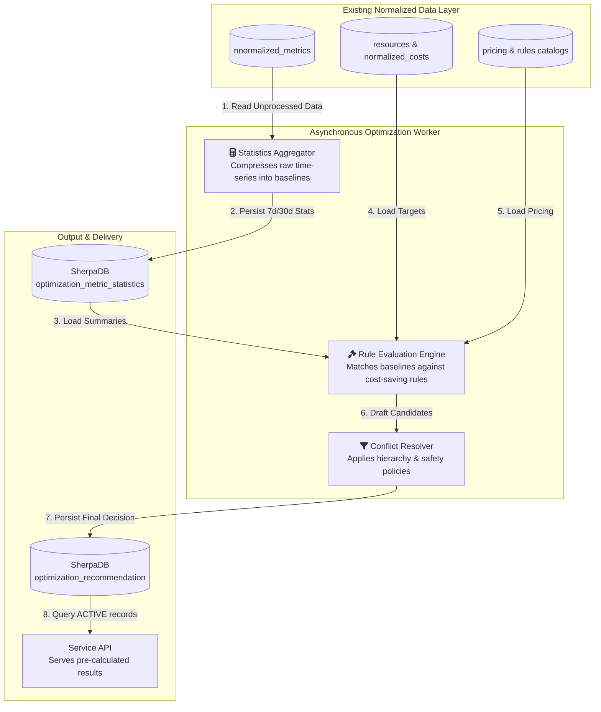
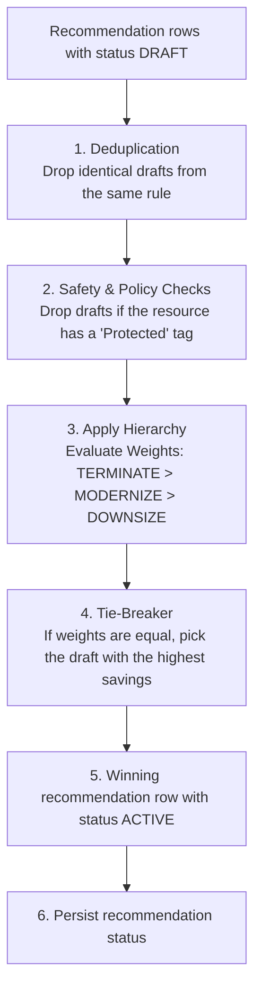
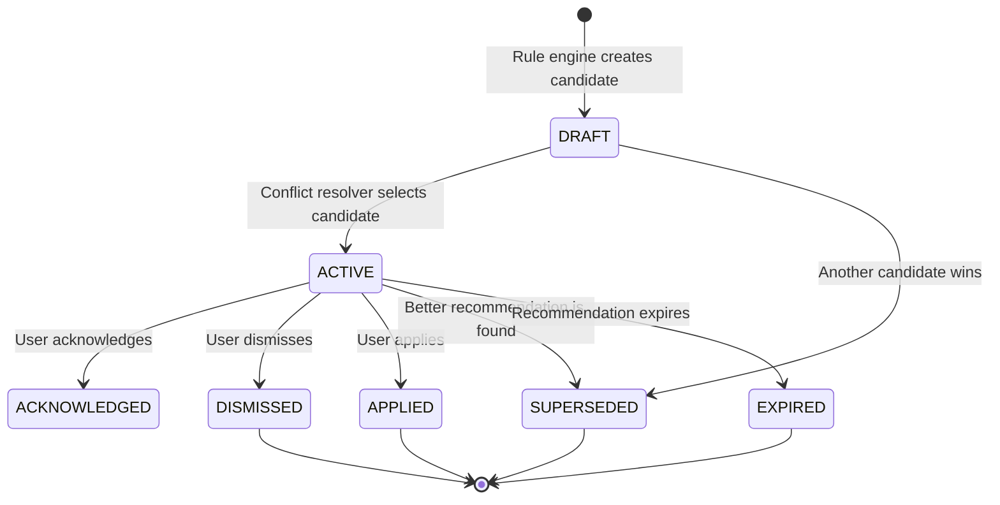
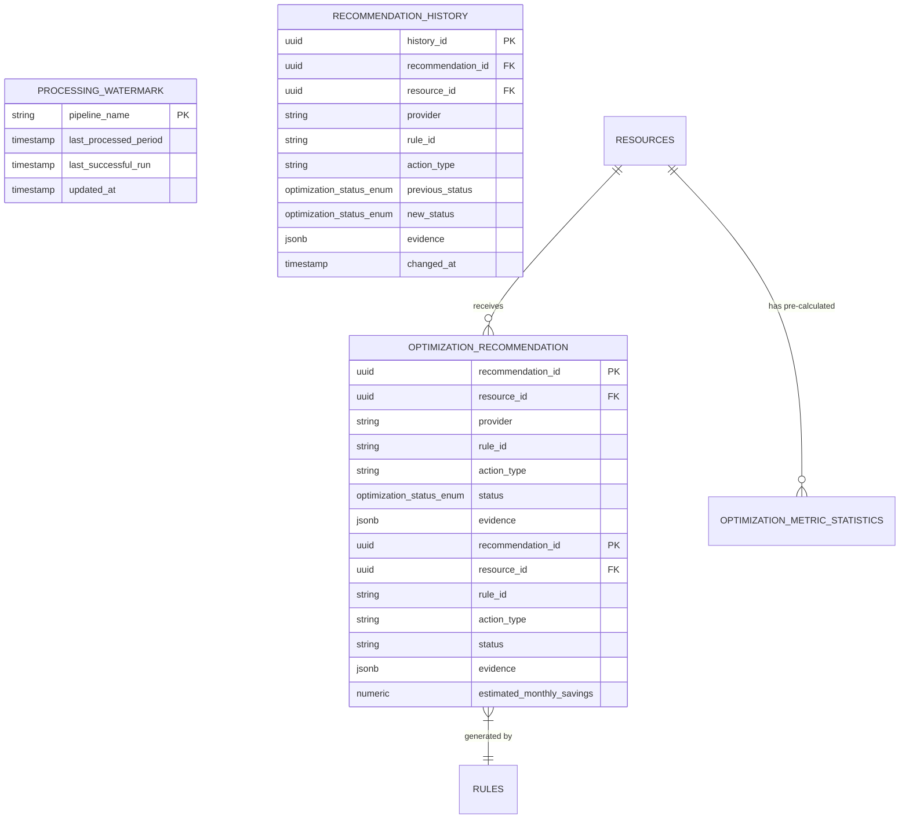

# CloudSherpa Optimization Recommendation System

## Overall Optimization Recommendation Architecture

The **CloudSherpa Optimization Recommendation** Engine employs an asynchronous, batch-processing architecture designed to decouple heavy analytical queries from synchronous user interactions.

This system begins its lifecycle directly at the database tier. It reads from the existing normalized data, processes it in the background, and outputs finalized, highly performant records for the dashboard to consume.



## Component Responsibilities

### Asynchronous Optimization Worker

This is a scheduled background process responsible for all heavy lifting. Driven by a standard **Spring scheduler**, the worker runs **once each day**. 

- **Scheduling & Reading**: It reads the `processing_watermark` table to see where it left off, pulls the last 24 hours of unprocessed normalized metrics from SherpaDB to update the baselines, evaluates the rules, updates the recommendations, and goes back to sleep.
- **Calculating**: Computes heavy statistical summaries (percentiles, standard deviations) and saves them to SherpaDB.
- **Evaluating**: Runs the generated statistics against optimization rules.
- **Resolving**: Filters out duplicate or mutually exclusive actions (e.g., choosing "Terminate" over "Downsize") and checks safety policies.
- **Persisting**: Writes the final, resolved recommendation (including the mathematical evidence) to the database.

### Service Application

The API layer acts as a lightweight delivery mechanism.

- **Reading**: Queries the optimization_recommendation table for active records.
- **State Management**: Updates the status of a recommendation when a user interacts with it (e.g., changing status to ACKNOWLEDGED or DISMISSED).
- **Constraint**: The API must not calculate P95, standard deviations, or any other expensive statistics during a request.

### Database

- **SherpaDB**: It provides the input context (`resources`, `normalized_costs`, `catalogs`) and stores the output artifacts (`optimization_metric_statistics`, `optimization_recommendation`, processing watermarks).

### Dashboard

- **Display**: Renders the active recommendations and their supportingevidence.
- **Evidence Visualization**: Displays the underlying evidence (e.g., showing the user that their P95 CPU was only 12%) to build trust in the automated recommendation.
- **Actionable Controls**: Allows the user to acknowledge or dismiss recommendations.

## Statistical Aggregation Approach

The statistical aggregation approach is designed to prevent system timeouts by moving all complex math out of the user's critical path. It uses a watermark-based processing strategy.

- **The Watermark Strategy**: The Optimization Scheduler relies on a durable `processing_watermark` table. When the scheduler wakes up, it checks this table to see exactly when it last successfully processed data for a specific tenant.

- **Database-Native Calculation**: Whenever possible, statistical functions (like averages and max values) are pushed down to the database level using native SQL analytical functions, rather than pulling millions of raw rows into the application's memory heap.

- **Persistent Storage**: The resulting summaries are upserted into the `optimization_metric_statistics` table. The Rule Engine will only ever query this summary table, never the raw metrics tables.

## Required Statistical Windows and Metrics

To prevent false positives (like recommending a server be downsized just because it had a quiet weekend), the engine requires long-term context and data quality checks.

### Statistical Windows

Statistics are generally calculated over distinct rolling windows to capture both immediate spikes and long-term trends:

- **4-Day Window (4d)**: For the initial deployment and system demos, the engine uses a 4-day window. This bypasses the typical 14-day new-resource lockout and 30-day baseline requirements. Pre-calculated mock data will be seeded to ensure end-to-end functionality during demos.
- **7-Day Window (7d)**: Used to detect short-term maximums, recent usage spikes, and immediate behavioral changes.
- **30-Day Window (30d)**: Used to establish reliable, long-term operational baselines and accurate monthly cost projections.

### Required Metrics
For every combination of Tenant + Resource + Canonical Metric + Window, the aggregator calculates and stores the following fields:

**Core Distribution Metrics**

- **minimum_value & maximum_value**: The absolute floor and ceiling of the resource's usage.
- **average_value & median_value**: The general, day-to-day operational baseline.
- **p95_value & p99_value (Percentiles)**: Crucial for safe recommendations. P95 strips out the top 5% of usage spikes (like brief CPU spikes during a reboot). Sizing a server based on P95 ensures it can handle sustained heavy load without over-provisioning for rare anomalies.
- **standard_deviation**: Measures the volatility of the workload. A highly erratic workload (high deviation) is riskier to downsize than a perfectly flat, consistent workload (low deviation).

**Anomaly Metrics**

- **spike_count**: How many times usage breached a defined maximum threshold.
- **peak_duration_seconds**: The total continuous time the resource spent maxed out.

## Rule Configuration Format

To keep the system accessible and highly performant, optimization rules are defined using standard SQL queries.

Because the Optimization Worker has already calculated and stored the necessary metrics in the `optimization_metric_statistics` table, a rule is simply a query that joins the target resources with their underlying statistics to find matches.

**Example Rule Definition (Downsize Underutilized Compute)**:

```SQL
-- Rule: COMPUTE-DOWNSIZE
-- Action: DOWNSIZE

SELECT 
    r.resource_id,
    r.provider,
    r.resource_type,
    'DOWNSIZE' AS action_type
FROM 
    resources r
JOIN 
    optimization_metric_statistics stat_4d 
    ON r.resource_id = stat_4d.resource_id 
    AND stat_4d.window_type = '4d'
WHERE 
    -- Target specific resource types across any cloud
    r.resource_type IN ('compute_instance', 'virtual_machine')
    
    -- The server rarely exceeded 20% CPU over the last 4 days
    AND stat_4d.metric_name = 'cpu_percent'
    AND stat_4d.p95_value < 20
    
    -- We have enough data points from the last 4 days to trust these numbers
    AND stat_4d.completeness_ratio >= 0.90;
```

## Rule Validation

Before a rule is activated in the engine, it is executed via an internal EXPLAIN statement. If PostgreSQL compiles the query successfully without syntax errors or missing column references, the rule is considered structurally valid and safe for the worker to run.

## Recommendation Candidate Model

Rule evaluation creates a recommendation row with status DRAFT.
The conflict resolver evaluates DRAFT rows and promotes the winning row
to ACTIVE. Other rows may become SUPERSEDED or DISMISSED.

### A Candidate contains:

- **Target Resource ID**: The UUID of the resource.
- **Rule ID**: Which specific SQL rule triggered this draft.
- **Action Type**: The proposed action (e.g., TERMINATE, DOWNSIZE, etc). The engine primarily focuses on recommending this action.
- **Evidence**: The raw JSON payload of the specific metrics that triggered the rule, ensuring the final decision is fully explainable to the user.

## Conflict-Resolution Hierarchy

It is common for a single poorly-optimized server to trigger multiple rules simultaneously. For example, a server that has been completely abandoned might trigger both a DOWNSIZE rule (because its CPU is low) and a TERMINATE rule (because its network traffic is zero).

To prevent spamming the user with conflicting advice, the Conflict Resolver acts as a traffic cop. It groups all candidate drafts by resource_id and processes them through a strict, defined hierarchy.

## Resolution Logic & Weights

The engine ranks actions by weight, favoring the most financially impactful or logically absolute action:

- **TERMINATE (Weight 100)**: Overrides all other actions. If a resource is completely idle, there is no point in downsizing or modernizing it.
- **MODERNIZE (Weight 75)**: Overrides downsize. Shifting to a newer generation family (e.g., AWS m5 to m6i) usually provides better price-to-performance than just shrinking an older instance type.
- **DOWNSIZE (Weight 50)**: Standard right-sizing.
- **SUSPEND (Weight 25)**: Recommending a power-schedule (shutting down at night) for environments that cannot be permanently terminated or downsized.

## The Resolution Flow



## Safety Checks and Protected-Resource Policies

To ensure the engine does not recommend destructive actions on critical infrastructure, the Conflict Resolver enforces a strict safety policy before any candidate becomes an ACTIVE recommendation.

- **Tag-Based Protection**: The engine checks the resource's normalized tags for protection flags (e.g., sherpa:do-not-optimize=true). Any draft targeting a protected resource is instantly discarded.
- **Recent Activity Lockout**: The engine verifies the resource's creation date. Resources provisioned recently (e.g., under 14 days in production) are ignored to avoid prematurely downsizing instances that are still scaling up.
- **Data Completeness Gate**: As established in the statistical metrics, if a resource's completeness_ratio is below 0.95, it is considered unsafe to optimize, and the draft is rejected.

## Recommendation Lifecycle and Statuses

A recommendation moves through a specific lifecycle based on system events and user interactions.

### Supported Statuses

- **DRAFT**: A candidate created by the rule engine and awaiting conflict resolution.
- **ACTIVE**: The recommendation is currently valid and awaiting user action.
- **ACKNOWLEDGED**: The user has seen the recommendation and plans to act on it, temporarily hiding it from the primary alert view.
- **DISMISSED**: The user explicitly rejected the recommendation.
- **APPLIED**: The user indicated that the recommendation was applied.
- **SUPERSEDED**: The Rule Engine found a better recommendation for this resource, so this older one is archived.
- **EXPIRED**: The recommendation is older than 30 days and the underlying metrics have shifted, making it invalid.

## Lifecycle Flowchart



## Database Tables and Relationships

The Optimization Engine uses four tenant-isolated tables in SherpaDB to maintain state, history, and results.



## Recommendation API Endpoints and Response Structure

Endpoints:

`GET /api/v1/optimization/recommendations` (List with filters)

`GET /api/v1/optimization/recommendations/{id}` (Detail)

`PATCH /api/v1/optimization/recommendations/{id}/status` (Acknowledge/Dismiss)

**Standard Response Payload**

```json
{
  "recommendation_id": "a1b2c3d4",
  "resource_id": "f5e6d7c8",
  "provider": "AWS",
  "action_type": "DOWNSIZE",
  "status": "ACTIVE",
  "evidence": {
    "cpu_percent_p95_4d": 18.4,
    "completeness_ratio": 0.99
  }
}
```

## Dashboard Integration Requirements

The UI must support the following capabilities to effectively utilize the API:

- **Filtering**: By Provider (AWS/Azure/GCP), Action Type (Terminate/Downsize), and Status.
- **Sorting**: Defaults to sorting by Action Priority (e.g., Terminate over Downsize).
- **Evidence Panel**: When a user clicks a recommendation, an expandable drawer must render the JSON evidence block into human-readable text (e.g., "We recommend this because your P95 CPU was 18.4% over the last 4 days").