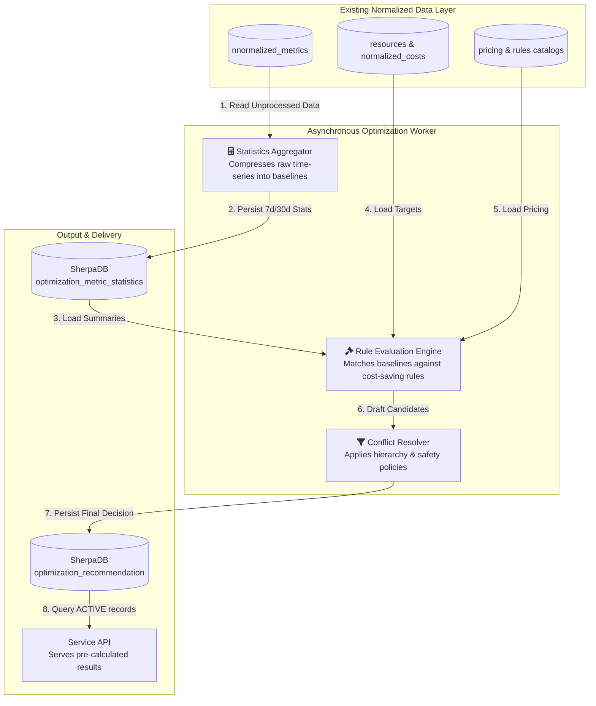
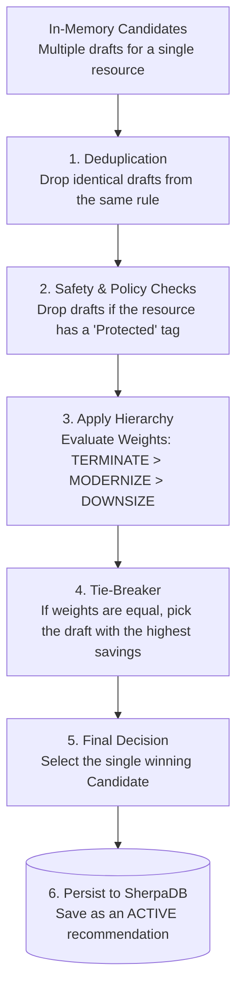

# CloudSherpa Optimization Recommendation System

## Overall Optimization Recommendation Architecture

The **CloudSherpa Optimization Recommendation** Engine employs an asynchronous, batch-processing architecture designed to decouple heavy analytical queries from synchronous user interactions.

This system begins its lifecycle directly at the database tier. It reads from the existing normalized data, processes it in the background, and outputs finalized, highly performant records for the dashboard to consume.



## Component Responsibilities

### Asynchronous Optimization Worker

This is a scheduled background process responsible for all heavy lifting:

- **Reading**: Pulls unprocessed normalized metrics from SherpaDB based on a durable processing watermark.
- **Calculating**: Computes heavy statistical summaries (percentiles, standard deviations) and saves them to SherpaDB.
- **Evaluating**: Reads pricing and resource catalogs, then runs the generated statistics against optimization rules.
- **Resolving**: Filters out duplicate or mutually exclusive actions (e.g., choosing "Terminate" over "Downsize") and checks safety policies.
- **Persisting**: Writes the final, resolved recommendation (including the mathematical evidence and estimated savings) to the database.

### Service Application

The API layer acts as a lightweight delivery mechanism.

- **Reading**: Queries the optimization_recommendation table for active records.
- **State Management**: Updates the status of a recommendation when a user interacts with it (e.g., changing status to ACKNOWLEDGED or DISMISSED).
- **Constraint**: The API must not calculate P95, standard deviations, or any other expensive statistics during a request.

### Database

- **SherpaDB**: It provides the input context (`resources`, `normalized_costs`, `catalogs`) and stores the output artifacts (`optimization_metric_statistics`, `optimization_recommendation`, processing watermarks).

### Dashboard

- **Display**: Renders the active recommendations and their estimated financial savings.
- **Evidence Visualization**: Displays the underlying evidence (e.g., showing the user that their P95 CPU was only 12%) to build trust in the automated recommendation.
- **Actionable Controls**: Allows the user to acknowledge or dismiss recommendations.

## Statistical Aggregation Approach

The statistical aggregation approach is designed to prevent system timeouts by moving all complex math out of the user's critical path. It uses a watermark-based processing strategy.

- **The Watermark Strategy**: The Optimization Scheduler relies on a durable `processing_watermark` table. When the scheduler wakes up, it checks this table to see exactly when it last successfully processed data for a specific tenant.

- **Database-Native Calculation**: Whenever possible, statistical functions (like averages and max values) are pushed down to the database level using native SQL analytical functions, rather than pulling millions of raw rows into the application's memory heap.

- **Persistent Storage**: The resulting summaries are upserted into the `optimization_metric_statistics` table. The Rule Engine will only ever query this summary table, never the raw metrics tables.

## Required Statistical Windows and Metrics

To prevent false positives (like recommending a server be downsized just because it had a quiet weekend), the engine requires long-term context and data quality checks.

### Statistical Windows

Statistics are calculated over two distinct rolling windows to capture both immediate spikes and long-term trends:

- **7-Day Window (7d)**: Used to detect short-term maximums, recent usage spikes, and immediate behavioral changes.
- **30-Day Window (30d)**: Used to establish reliable, long-term operational baselines and accurate monthly cost projections.

### Required Metrics
For every combination of Tenant + Resource + Canonical Metric + Window, the aggregator calculates and stores the following fields:

**Core Distribution Metrics**

- **minimum_value & maximum_value**: The absolute floor and ceiling of the resource's usage.
- **average_value & median_value**: The general, day-to-day operational baseline.
- **p95_value & p99_value (Percentiles)**: Crucial for safe recommendations. P95 strips out the top 5% of usage spikes (like brief CPU spikes during a reboot). Sizing a server based on P95 ensures it can handle sustained heavy load without over-provisioning for rare anomalies.
- **standard_deviation**: Measures the volatility of the workload. A highly erratic workload (high deviation) is riskier to downsize than a perfectly flat, consistent workload (low deviation).

**Anomaly Metrics**

- **spike_count**: How many times usage breached a defined maximum threshold.
- **peak_duration_seconds**: The total continuous time the resource spent maxed out.

## Rule Configuration Format

To keep the system accessible and highly performant, optimization rules are defined using standard SQL queries.

Because the Optimization Worker has already calculated and stored the necessary metrics in the `optimization_metric_statistics` table, a rule is simply a query that joins the target resources with their underlying statistics to find matches.

**Example Rule Definition (Downsize Underutilized Compute)**:

```SQL
-- Rule: COMPUTE-DOWNSIZE
-- Action: DOWNSIZE

SELECT 
    r.resource_id,
    r.provider,
    r.resource_type,
    'DOWNSIZE' AS action_type
FROM 
    resources r
JOIN 
    optimization_metric_statistics stat_30d 
    ON r.resource_id = stat_30d.resource_id 
    AND stat_30d.window_type = '30d'
JOIN 
    optimization_metric_statistics stat_7d 
    ON r.resource_id = stat_7d.resource_id 
    AND stat_7d.window_type = '7d'
WHERE 
    -- Target specific resource types across any cloud
    r.resource_type IN ('compute_instance', 'virtual_machine')
    
    -- The server rarely exceeded 20% CPU under normal heavy load over the last month
    AND stat_30d.metric_name = 'cpu_percent'
    AND stat_30d.p95_value < 20
    
    -- The server never spiked above 60% CPU in the last week
    AND stat_7d.metric_name = 'cpu_percent'
    AND stat_7d.maximum_value < 60
    
    -- We have almost all the data points, so we trust these numbers
    AND stat_30d.completeness_ratio >= 0.95;
```

## Rule Validation

Before a rule is activated in the engine, it is executed via an internal EXPLAIN statement. If PostgreSQL compiles the query successfully without syntax errors or missing column references, the rule is considered structurally valid and safe for the worker to run.

## Recommendation Candidate Model

When the Rule Engine executes these SQL queries, it does not immediately write a final recommendation to the database. Instead, the resulting rows are mapped into an in-memory Recommendation Candidate.

This separation is necessary because multiple rules might flag the exact same resource. The candidate model acts as a temporary holding state containing all the context needed to make a final decision.

### A Candidate contains:

- **Target Resource ID**: The UUID of the resource.
- **Rule ID**: Which specific SQL rule triggered this draft.
- **Action Type**: The proposed action (e.g., TERMINATE, DOWNSIZE, etc).
- **Target Configuration**: The proposed new state (e.g., shifting from t3.2xlarge to t3.xlarge).
- **Estimated Savings**: The calculated monthly savings derived from the pricing catalog.
- **Evidence**: The raw JSON payload of the specific metrics that triggered the rule, ensuring the final decision is fully explainable to the user.

## Conflict-Resolution Hierarchy

It is common for a single poorly-optimized server to trigger multiple rules simultaneously. For example, a server that has been completely abandoned might trigger both a DOWNSIZE rule (because its CPU is low) and a TERMINATE rule (because its network traffic is zero).

To prevent spamming the user with conflicting advice, the Conflict Resolver acts as a traffic cop. It groups all candidate drafts by resource_id and processes them through a strict, defined hierarchy.

## Resolution Logic & Weights

The engine ranks actions by weight, favoring the most financially impactful or logically absolute action:

- **TERMINATE (Weight 100)**: Overrides all other actions. If a resource is completely idle, there is no point in downsizing or modernizing it.
- **MODERNIZE (Weight 75)**: Overrides downsize. Shifting to a newer generation family (e.g., AWS m5 to m6i) usually provides better price-to-performance than just shrinking an older instance type.
- **DOWNSIZE (Weight 50)**: Standard right-sizing.
- **SUSPEND (Weight 25)**: Recommending a power-schedule (shutting down at night) for environments that cannot be permanently terminated or downsized.

## The Resolution Flow

