# Wireframes

## Landing Page
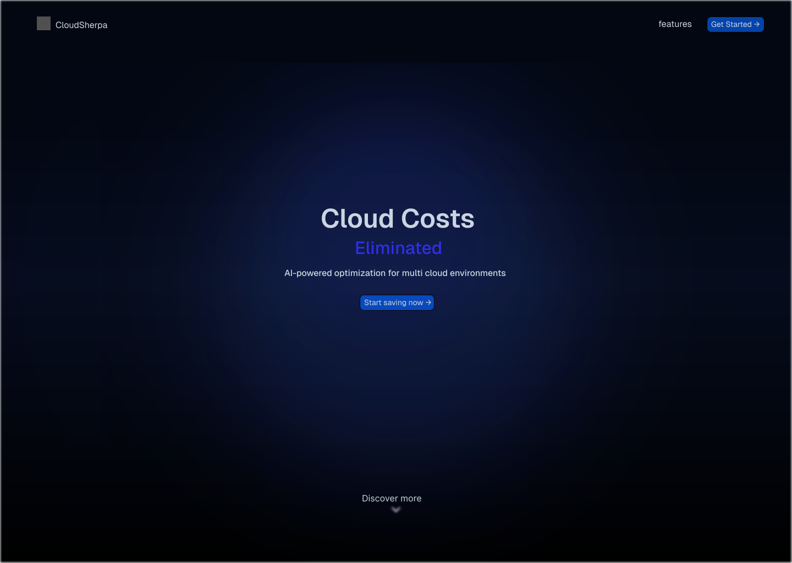

*Figure 1: Landing page wireframe*

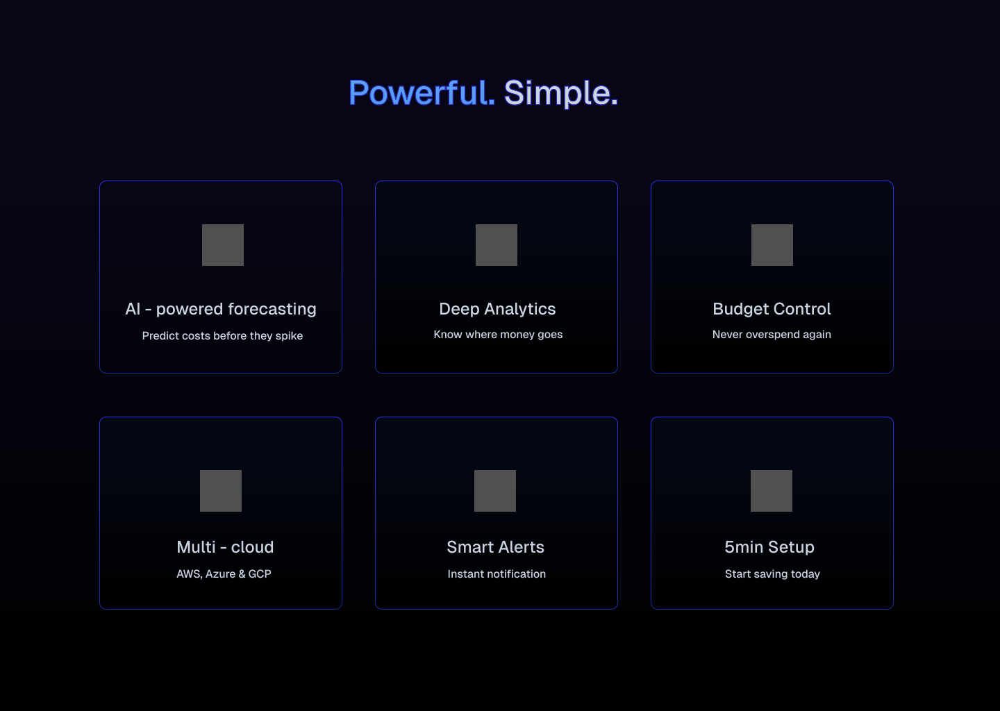

*Figure 2: CloudSherpa features*

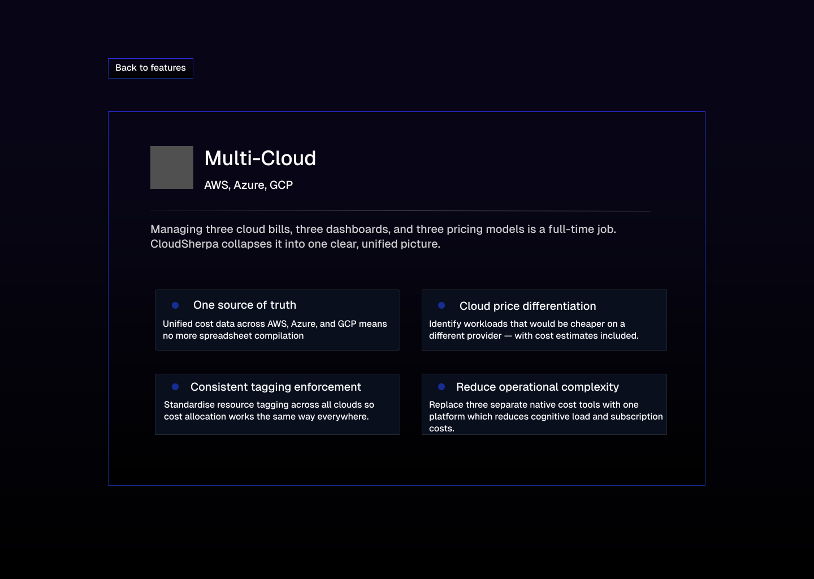

*Figure 3: Detailed information about feature*

## Login
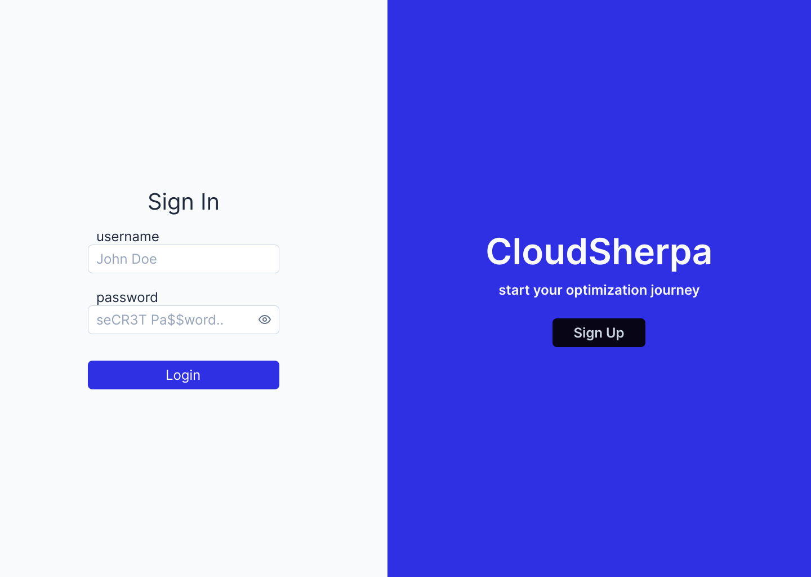

*Figure 4: Light mode version of login*

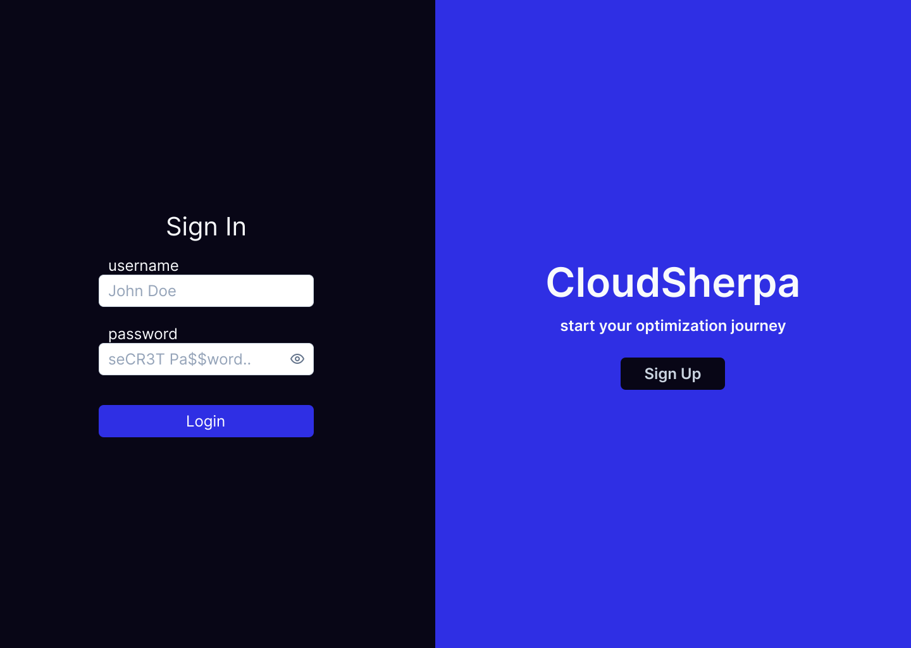

*Figure 5: Dark mode version of login*

## Register
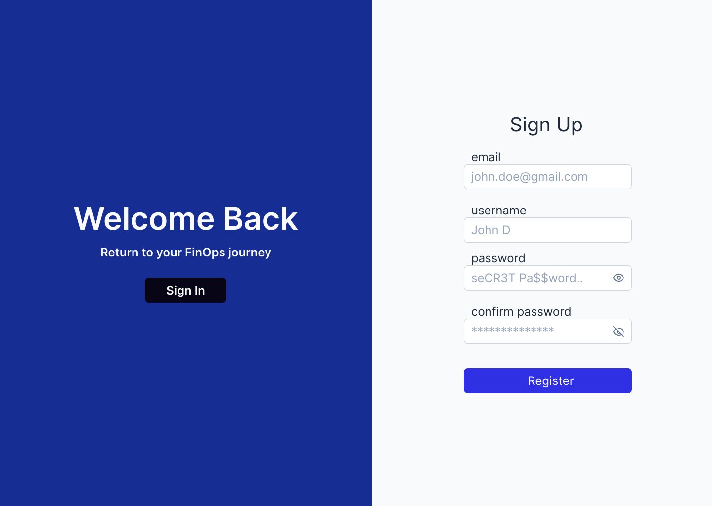

*Figure 6: Light mode version of register*

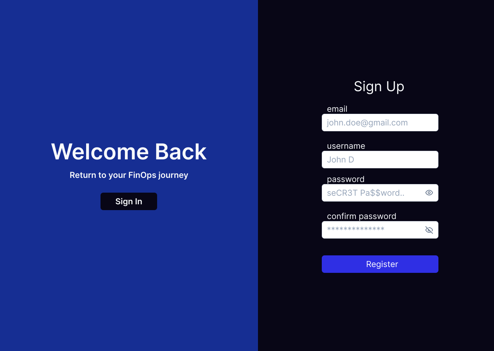

*Figure 7: Dark mode version of register*

## Dashboard

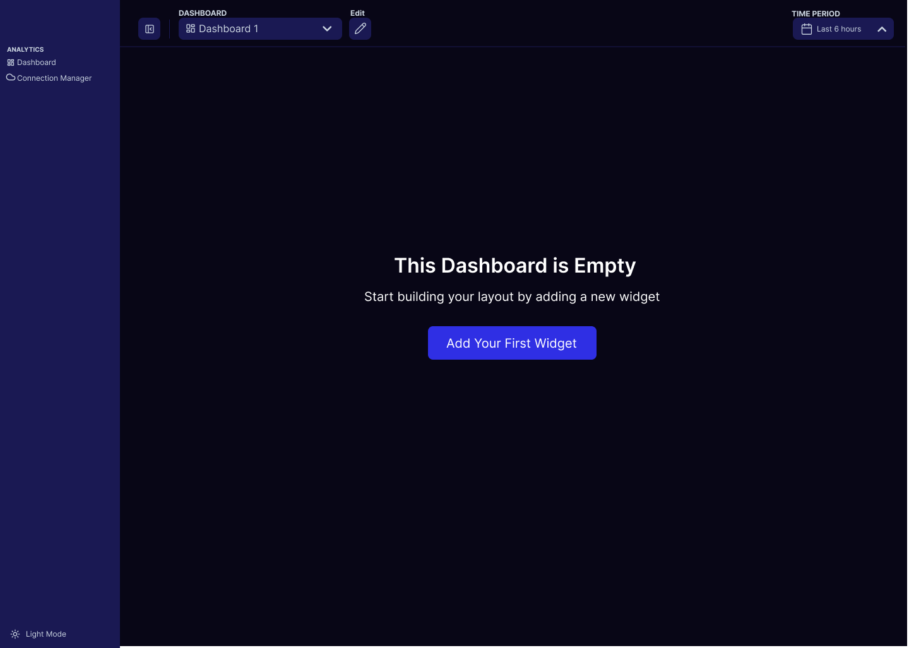

*Figure 8: View of dashboard when registered*

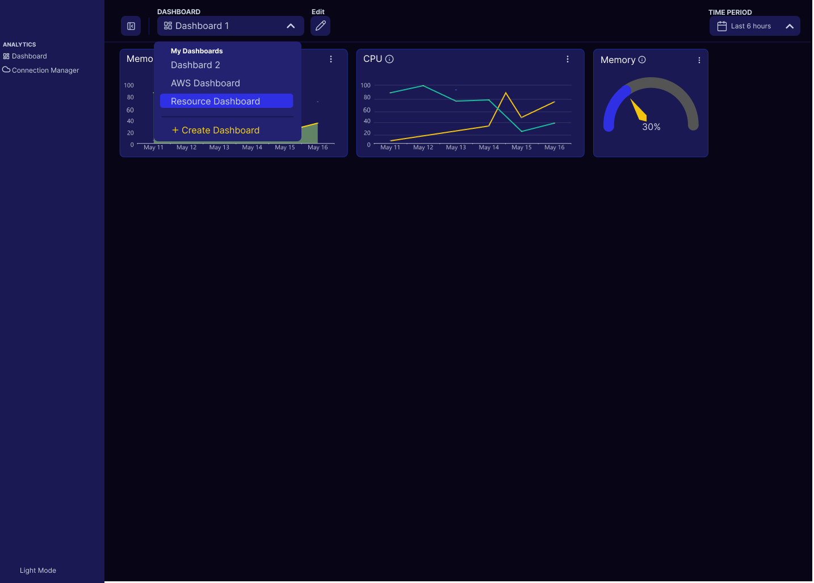

*Figure 9: User can select which dashboard they want to view*

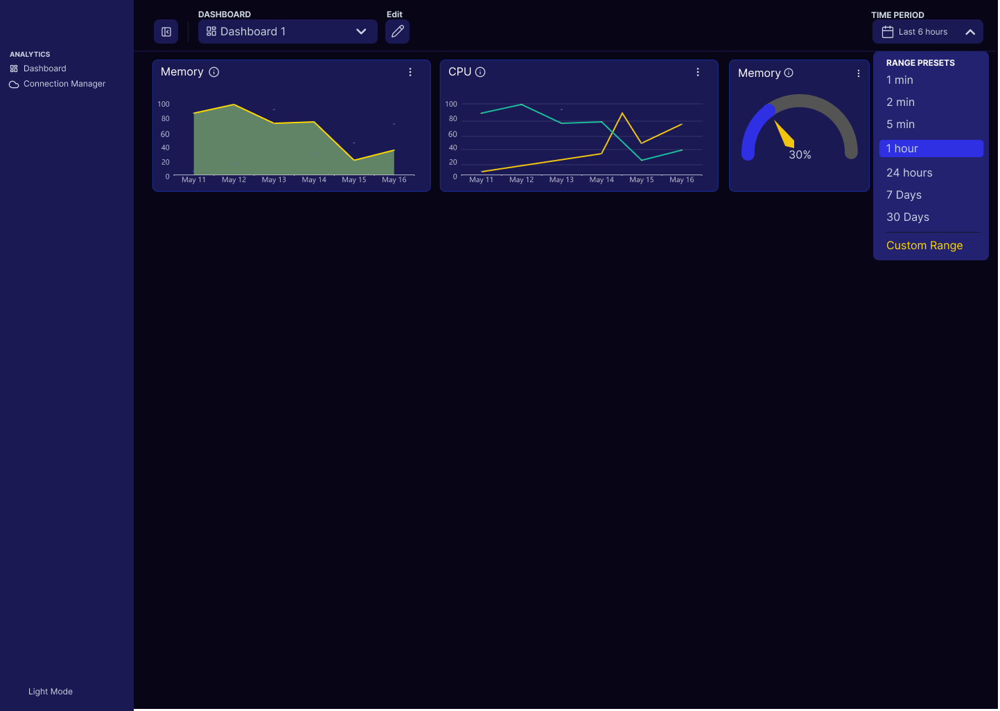

*Figure 10: User can select the time period they want to monitor the data*

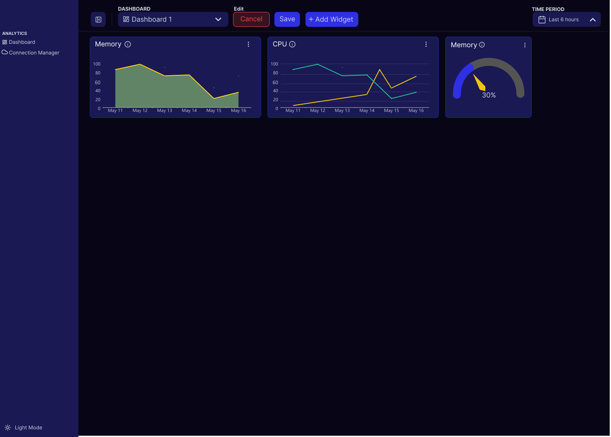

*Figure 11: User can edit wigets*

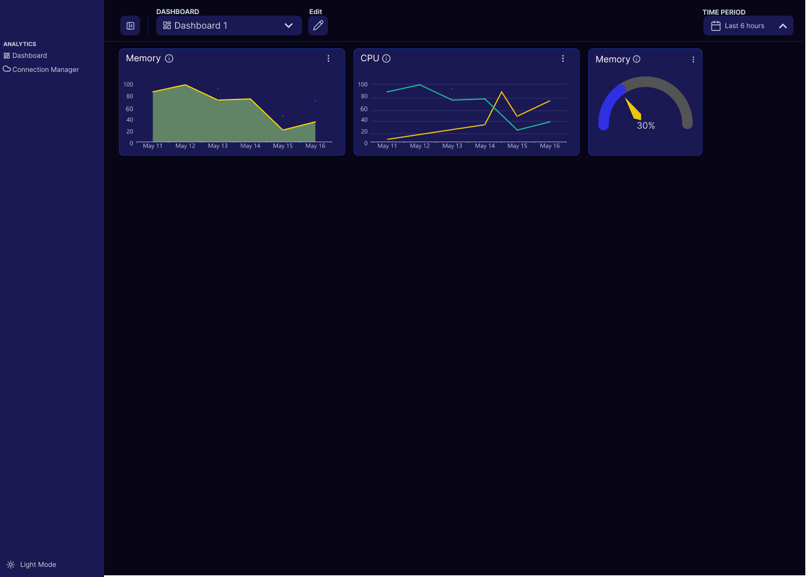

*Figure 12: View of dashboard after widgets have been added*

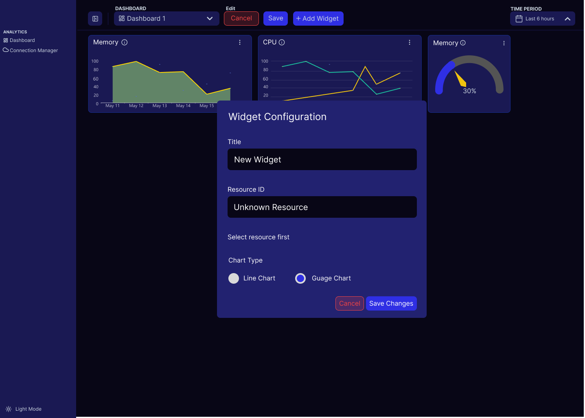

*Figure 12: User can configure the widgets*